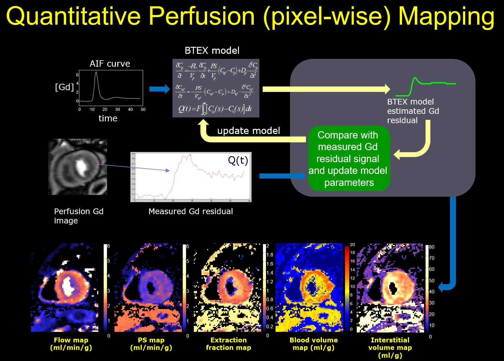
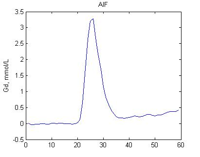

# QPerf: Collected development for Automatic In-line Quantitative Myocardial Perfusion Mapping

Quantitative perfusion (QPerf) is an emerging technique to directly measure blood supply to the myocardial muscle. It is demonstrating potential to be a valid clinical tool for ischemia and many non-ischemic cardiac disease. 

This repo collects tools we developed for QPerf.

## Perfusion Flow mapping

This repo contains the cardiac flow mapping tool we developed, in supplement to our paper published at [Magnetic Resonance in Medicine](https://onlinelibrary.wiley.com/journal/15222594), titled "Automatic In-line Quantitative Myocardial Perfusion Mapping: processing algorithm and implementation". This paper is can be found [here](https://onlinelibrary.wiley.com/doi/full/10.1002/mrm.27954).

The Blood-tissue-exchange model (BTEX [1](by Prof. James Bassingthwaighte, https://www.physiome.org/)) is used in this study for quantitative perfusion. For fully disclosure, there are many different models proposed in past two decades [2](https://www.ncbi.nlm.nih.gov/pubmed/22173205). 

BTEX model (20 version) solves two partial differential equations for myocardial blood flow (MBF, ml/min/g), permeability-surface-area product (PS, ml/min/g), blood volume (V_b, ml/g) and interstitial volume (V_isf, ml/g).



To perform perfusion fitting, two inputs are needed: Cin and y. Cin is the input function for myocardium (e.g. arterial input function, AIF, measured from dual-sequence perfusion imaging) and y is the myocardial signal. Both Cin and y should be converted to Gd concentration unit (mmol/L) or have the same scale to the Gd concentration. Otherwise, the estimated flow will be off by a scaling factor.

The QPerf mapping is provided as a function call:

```
gadgetron_QPerf_mapping -h
Allowed options:
  -h [ --help ]                         Produce HELP message
  -f [ --cin_file ] arg (=cin_file)     <AIF signal, [N 1]>
  -i [ --y_file ] arg (=perf_file)      <input perfusion Gd images, [RO E1 N]>
  -m [ --fmap_file ] arg (=MBF)         <output flow map, [RO E1]>
  --foot arg (=0)                       <foot for aif signal>
  --dt arg (=500)                       <sampling interval in ms, e.g. 500ms>
  --hematocrit arg (=0.42)              <hematocrit, default 0.42>
```
This function will compute BTEX look-up-table (LUT) and perform pixel-wise mapping.

The **examples** folder has running example file to demonstrate the usage of these commands.

To install the software, clone this repo and add **%BASE_DIR%/QPerf/software** to your path, suppose the repo was cloned to **%BASE_DIR**.

Current version of software was tested in windows 10.

An example of perfusion AIF and imaging data are provided in the examples folder. 

<p align="center">
  
</p>

<p align="center">
  
</p>

## Perfusion AIF LV detection using Deep Learning

The second part of work shared through this repo is our deep learning model used to detection LV for perfusion arterial input function (AIF) signal extraction. This work had been submitted to [Magnetic Resonance in Medicine](https://onlinelibrary.wiley.com/journal/15222594) and currently under review.

The deep neural net models can be found at deep_learning/aif_detection folder. The used ResUNet model and example datasets are shared.

------------------------------------------------------------------------------------------------

For more comments and suggestions, please contact me at :

```
Hui Xue
National Heart Lung and Blood Institute (NHLBI)
National Institutes of Health
10 Center Drive, MSC-1061
Bethesda, MD 20892-1061
USA

Email: hui.xue@nih.gov
```
